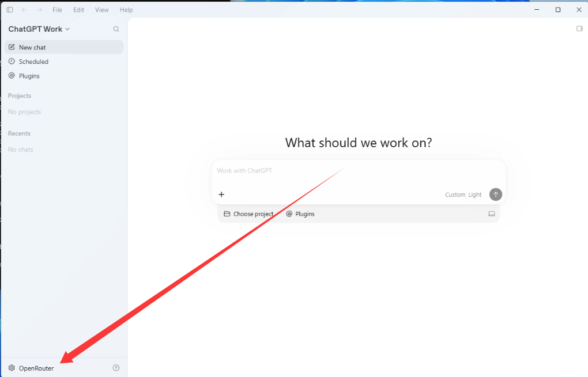
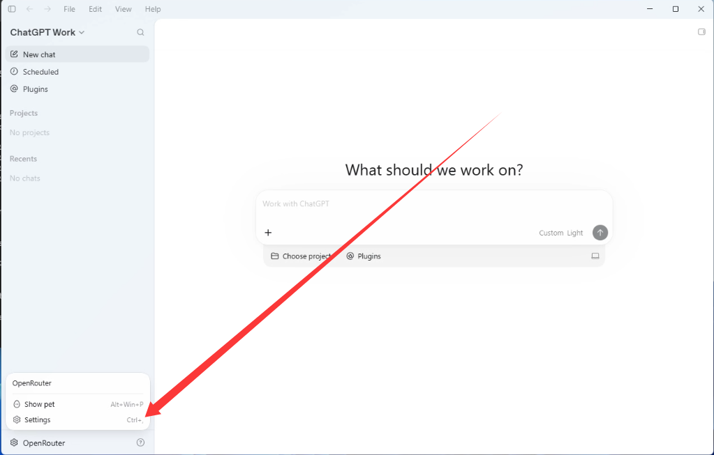
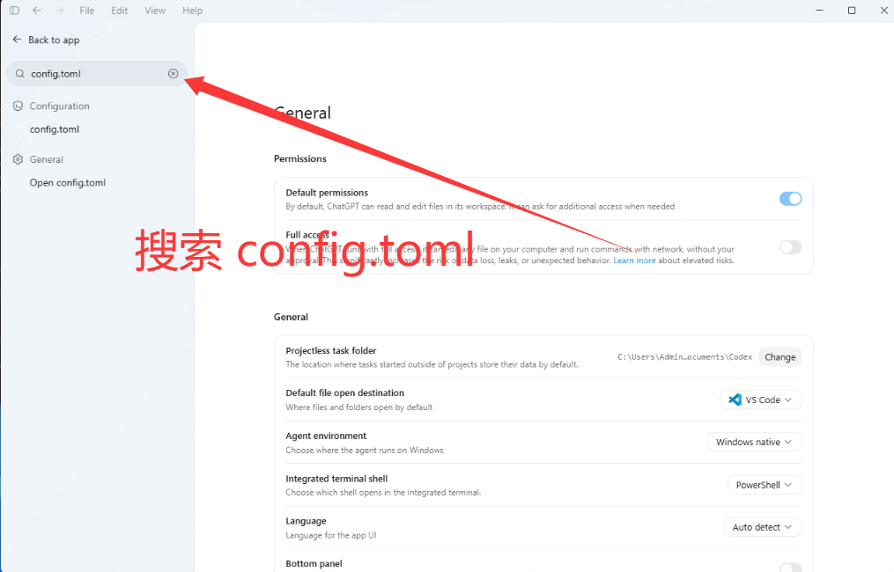
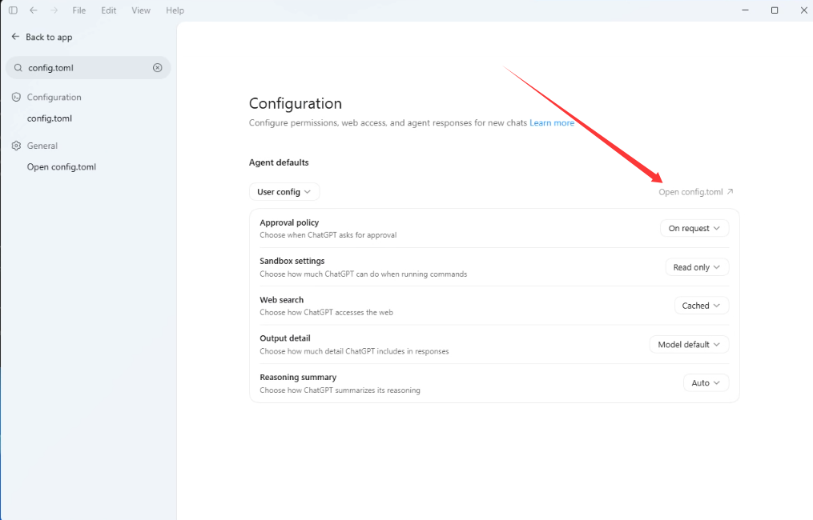
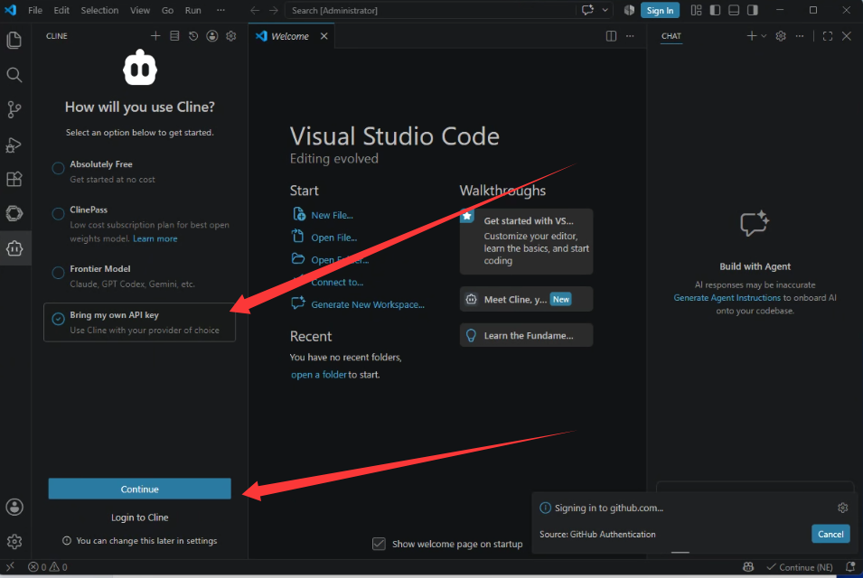
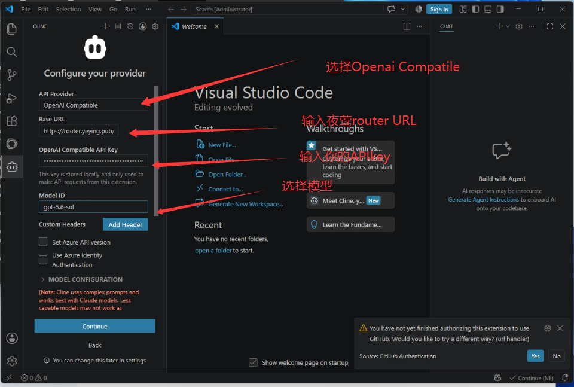
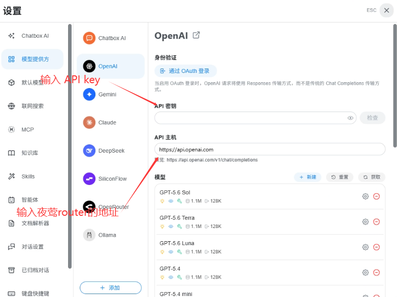

# Codex App、Cline、Continue、Chatbox、Cherry Studio 接入夜莺 Router

## 一、Codex App 接入

**测试环境**

| 项目 | 内容 |
| --- | --- |
| 操作系统 | Windows 10 Pro 26H1（Build 28000.2954，64 位） |
| 客户端 | Codex App Windows 客户端 `26.915.4065.0` |

### 1. 下载 Codex App

请前往 OpenAI 官方 Codex 页面下载：

```text
https://openai.com/codex
```

Windows 用户也可以通过 Microsoft Store 安装。

### 2. 打开 config.toml

推荐从 Codex App 设置里打开配置文件，避免找错目录。

打开 Codex App 后，点击左下角账号或工作区入口。



在弹出的菜单中点击 `Settings`。



在设置页左侧搜索框输入：

```text
config.toml
```



点击左侧搜索结果中的 `config.toml`，再点击右侧的 `Open config.toml`。



如果需要手动查找，也可以打开：

```text
C:\Users\你的用户名\.codex
```

在这个文件夹中找到或新建：

```text
config.toml
```

注意文件名必须是 `config.toml`，不要保存成 `config.toml.txt`。

### 3. 写入配置

打开 `config.toml` 后，将下面内容复制进去，并把 `YOUR_YEYING_ROUTER_API_KEY` 替换为自己的夜莺 Router API Key。

```toml
model = "gpt-5.6-sol"
model_provider = "yeying"

[model_providers.yeying]
name = "Yeying Router"
base_url = "https://router.yeying.pub/v1"
wire_api = "responses"
experimental_bearer_token = "YOUR_YEYING_ROUTER_API_KEY"
```

保存后，完全退出 Codex App，再重新打开。

### 4. 验证

新建一个 Codex 会话，发送：

```text
请只回复 OK
```

如果模型正常回复，说明 Codex App 已经通过夜莺 Router 调用模型。

---

## 二、VS Code 插件接入

VS Code 中推荐优先配置 Cline。如果客户正在使用 Continue，也可以按 Continue 的方式配置。

## 方案 A：Cline

**测试环境**

| 项目 | 内容 |
| --- | --- |
| 操作系统 | Windows 10 Pro 26H1（Build 28000.2954，64 位） |
| 编辑器 | VS Code Windows 版 `1.138.0` |
| 插件 | Cline（扩展 ID：`saoudrizwan.claude-dev`，测试版本：`4.1.19`） |

### 1. 安装 Cline

打开 VS Code 扩展市场，搜索并安装：

```text
Cline
```

也可以打开扩展页面：

```text
https://marketplace.visualstudio.com/items?itemName=saoudrizwan.claude-dev
```

### 2. 选择自带 API Key

打开 Cline 面板，选择：

```text
Bring my own API key
```

然后点击：

```text
Continue
```



### 3. 填写配置

| 配置项 | 填写内容 |
| --- | --- |
| API Provider | `OpenAI Compatible` |
| Base URL | `https://router.yeying.pub/v1` |
| OpenAI Compatible API Key | 夜莺 Router API Key |
| Model ID | `gpt-5.6-sol` |



填写完成后点击 `Continue`。

### 4. 验证

在 Cline 对话里发送：

```text
reply exactly OK
```

如果返回 `OK`，说明 Cline 已经通过夜莺 Router 调用模型。

如果返回 `403 Forbidden` 或“令牌额度不足”，通常表示请求已经到达夜莺 Router，但当前 API Key 的额度、套餐或模型权限不足，请联系管理员检查该 Key 的额度和模型权限。

## 方案 B：Continue

**测试环境**

| 项目 | 内容 |
| --- | --- |
| 操作系统 | Windows 10 Pro 26H1（Build 28000.2954，64 位） |
| 编辑器 | VS Code Windows 版 `1.138.0` |
| 插件 | Continue（扩展 ID：`continue.continue`，测试版本：`2.0.0`） |

### 1. 安装 Continue

打开 VS Code 扩展市场，搜索并安装：

```text
Continue
```

也可以打开扩展页面：

```text
https://marketplace.visualstudio.com/items?itemName=Continue.continue
```

### 2. 打开配置目录

打开 Windows 文件资源管理器，在地址栏输入：

```text
C:\Users\你的用户名\.continue
```

如果没有 `.continue` 文件夹，可以手动创建。

### 3. 配置 config.yaml

在 `.continue` 文件夹中创建或打开：

```text
config.yaml
```

将下面内容复制进去，并把 `YOUR_YEYING_ROUTER_API_KEY` 替换为自己的夜莺 Router API Key。

```yaml
name: Yeying Router
version: 1.0.0
schema: v1

models:
  - name: Yeying gpt-5.6-sol
    provider: openai
    model: gpt-5.6-sol
    apiBase: https://router.yeying.pub/v1
    apiKey: YOUR_YEYING_ROUTER_API_KEY
    roles:
      - chat
      - edit
      - apply
    capabilities:
      - tool_use
```

保存后，重启 VS Code。

### 4. 验证

打开 Continue 面板，发送：

```text
reply exactly OK
```

如果返回 `OK`，说明 Continue 已经通过夜莺 Router 调用模型。

---

## 三、Chatbox 接入

**测试环境**

| 项目 | 内容 |
| --- | --- |
| 操作系统 | Windows 10 Pro 26H1（Build 28000.2954，64 位） |
| 客户端 | Chatbox Windows 客户端 `1.23.1` |

Chatbox 是普通聊天客户端，适合用于日常对话和模型可用性验证。

### 1. 下载 Chatbox

打开 Chatbox 官网下载并安装：

```text
https://chatboxai.app
```

### 2. 打开模型提供方设置

打开 Chatbox 后，进入：

```text
设置 → 模型提供方 → OpenAI
```

### 3. 填写夜莺 Router 配置

在 OpenAI 配置页中填写：

| 配置项 | 填写内容 |
| --- | --- |
| API 密钥 | 夜莺 Router API Key |
| API 主机 | `https://router.yeying.pub/v1` |
| 模型 | `gpt-5.6-sol` |



如果模型列表中没有 `gpt-5.6-sol`，可以点击 `新建` 手动添加模型。

### 4. 验证

填写完成后，点击页面中的 `检查`。

如果检查通过，说明 Chatbox 已经可以通过夜莺 Router 调用模型。

也可以回到聊天页面，选择 `gpt-5.6-sol`，发送：

```text
reply exactly OK
```

如果返回 `OK`，说明聊天调用正常。

---

## 四、Cherry Studio 接入

**测试环境**

| 项目 | 内容 |
| --- | --- |
| 操作系统 | Windows 10 Pro 26H1（Build 28000.2954，64 位） |
| 客户端 | Cherry Studio Windows 客户端 `2.1.0` |

Cherry Studio 是桌面模型客户端，适合用于日常对话、多模型切换和模型可用性验证。

### 1. 下载 Cherry Studio

打开 Cherry Studio 官网下载并安装：

```text
https://cherry-ai.com
```

### 2. 打开模型服务设置

打开 Cherry Studio 后，进入模型服务或模型提供方设置页面。

如果列表中有 OpenRouter 或 OpenAI Compatible 类型，可以直接使用对应类型；如果没有，可以添加一个 OpenAI 兼容的自定义服务。

### 3. 填写夜莺 Router 配置

| 配置项 | 填写内容 |
| --- | --- |
| API 地址 / Base URL | `https://router.yeying.pub/v1` |
| API Key | 夜莺 Router API Key |
| 模型 | `gpt-5.6-sol` |

保存配置后，将该模型设为当前聊天模型。

### 4. 验证

在 Cherry Studio 对话里发送：

```text
reply exactly OK
```

如果返回 `OK`，说明 Cherry Studio 已经通过夜莺 Router 调用模型。

---

## 五、常见问题

### 401 Unauthorized

如果出现 401，通常是 Codex App 没有正确带上夜莺 Router API Key。

请重点检查 `config.toml`：

```toml
model = "gpt-5.6-sol"
model_provider = "yeying"

[model_providers.yeying]
name = "Yeying Router"
base_url = "https://router.yeying.pub/v1"
wire_api = "responses"
experimental_bearer_token = "YOUR_YEYING_ROUTER_API_KEY"
```

需要确认：

- `experimental_bearer_token` 已替换为真实 API Key。
- `base_url` 是 `https://router.yeying.pub/v1`。
- 保存配置后，已经完全退出 Codex App 并重新打开。
- 不要额外添加 `requires_openai_auth = true`。

